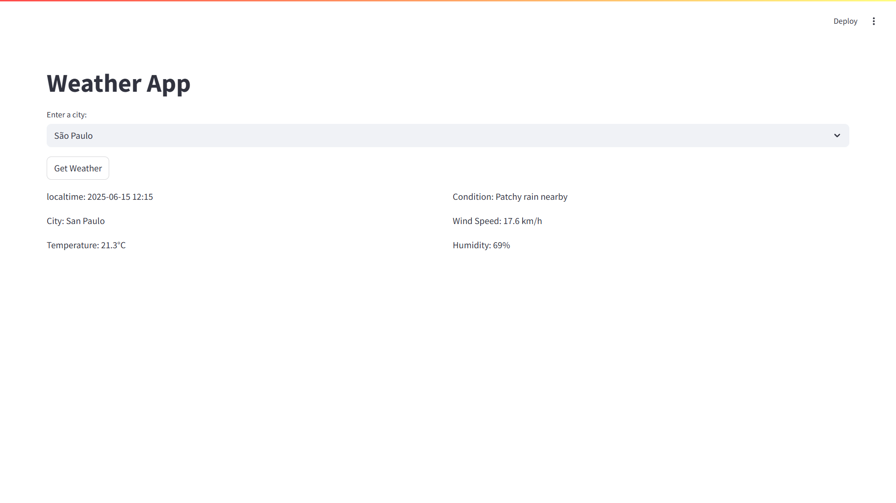
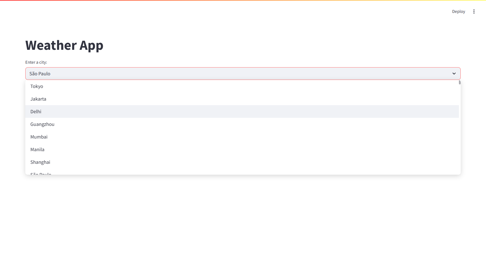

## 🌦️ Weather App

A simple and interactive **Streamlit** app that lets users search for and view real-time weather data for cities worldwide using the **WeatherAPI**.

---

### 📸 Demo




---

### 🚀 Features

* 🌍 Select from **global cities** via a dropdown
* 📡 Fetches real-time weather using **WeatherAPI**
* 💧 Displays temperature, condition, wind speed, humidity
* ⚡ Built with `Streamlit`, `Pandas`, and `Requests`

---

### 📁 Project Structure

```
weather-app/
├── data/
│   └── worldcities.csv         # City names for dropdown
├── app.py                      # Main Streamlit app
├── requirements.txt            # Dependencies
├── .gitignore                  # Files to exclude from Git
└── README.md                   # This file
```

---

### 🛠️ Installation & Usage

1. **Clone the repo**

   ```bash
   git clone https://github.com/yourusername/weather-app.git
   cd weather-app
   ```

2. **Create and activate a virtual environment (optional but recommended)**

   ```bash
   python -m venv venv
   source venv/bin/activate  # or venv\Scripts\activate on Windows
   ```

3. **Install dependencies**

   ```bash
   pip install -r requirements.txt
   ```

4. **Add your API key**
   Replace the `API` variable in `app.py` with your [WeatherAPI](https://www.weatherapi.com/) key:

   ```python
   API = "your_actual_api_key"
   ```

5. **Run the app**

   ```bash
   streamlit run app.py
   ```

---

### 📦 Requirements

* `streamlit`
* `requests`
* `pandas`

Create a `requirements.txt` file:

```txt
streamlit
requests
pandas
```

---

### 🧠 Notes

* API keys should never be hardcoded in public repos. Consider using a `.env` file + `python-dotenv` in production.
* The list of cities is loaded from a local CSV (`worldcities.csv`).

---

### ✨ Example Enhancement Ideas

* Add forecast support (e.g., next 3 days)
* Use a map to select locations
* Switch between Celsius and Fahrenheit

---

### 📄 License

This project is open source and available under the [MIT License](LICENSE).

---

